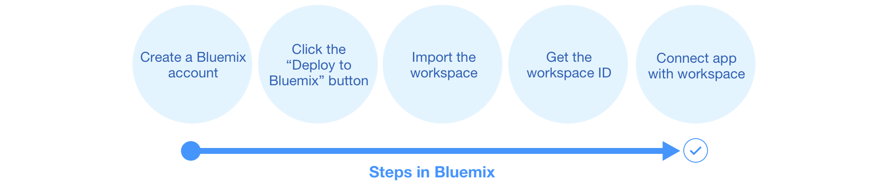
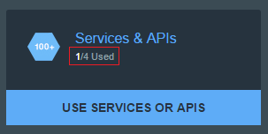
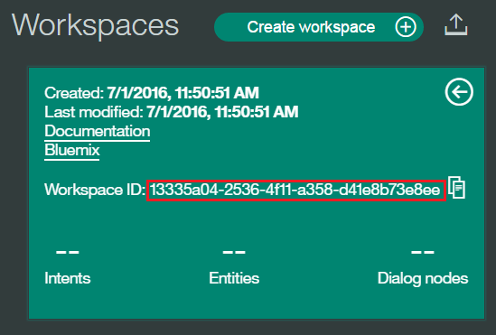
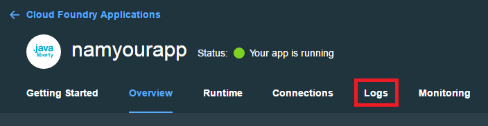

# Watson Conversation
[](https://jenkins.certsys.com.br/job/Watson-App-Conversation) [](https://www.versioneye.com/user/projects/57ebf395bd6fa600512e5ea0) [](https://github.com/certsys/dashboard-cs/pulse)

Esta aplicação demonstra como o serviço de conversação usa recursos de intenção em uma interface de bate-papo.

[Veja a Demo](http://conversation-app.mybluemix.net/).

De qualquer maneira que você implantar este aplicativo, você deve ter uma conta Bluemix e executar alguns passos dentro Bluemix.  

&nbsp;&nbsp;&nbsp;&nbsp;&nbsp;&nbsp;&nbsp;&nbsp;&nbsp;&nbsp;&nbsp;&nbsp;&nbsp;&nbsp;&nbsp;&nbsp;&nbsp;&nbsp;&nbsp;&nbsp;&nbsp;&nbsp;&nbsp;&nbsp;&nbsp;&nbsp;&nbsp;&nbsp;&nbsp;&nbsp;&nbsp;&nbsp;&nbsp;&nbsp;&nbsp;&nbsp;[](#bluemix)     &nbsp;&nbsp;&nbsp;&nbsp;&nbsp;&nbsp;&nbsp;&nbsp;&nbsp;&nbsp;&nbsp;&nbsp;&nbsp;&nbsp;&nbsp;&nbsp;&nbsp;&nbsp;&nbsp;&nbsp;&nbsp;&nbsp;&nbsp;&nbsp;[](#local)

## Como funciona o App
A interface do aplicativo é projetada e treinada para conversar com um o robo de inteligencia cognitiva da **Certsys**.
Suas perguntas e comandos são executados em um pequeno conjunto de dados treinados com as seguintes questões:

    Ola
    Tenho uma duvida
    Quanto tempo demora para obter um registro escolar?
    Entreguei a documentação hoje, já posso operar com o veículo?
    Posso encaminhar a documentação pelo Correios?

Estas intenções ajudam o sistema a compreender as variações de perguntas e comandos que você pode enviar.

Se você disser *"Documentação pelo correios"* ou *"Posso encaminhar a documentação"*, o sistema compreende que em ambos os casos a sua intenção é a mesma e responder adequadamente.

<a name="bluemix">
# Começando a usar o Bluemix
</a>



## Antes de começar
1 Garanta que você tem uma conta no [Bluemix account](https://console.ng.bluemix.net/registration/).

2 Certifique-se de que você tem o espaço necessário disponível em sua conta Bluemix. Esta ação implanta um aplicativo e 1 de serviço.
   * Você pode ver isso em seu Bluemix Dashboard. será apresentado o espaço que você tem disponível.
   * Por exemplo, para Serviços & APIS

    &nbsp;&nbsp;&nbsp;&nbsp;&nbsp;&nbsp;&nbsp;&nbsp;&nbsp;&nbsp;&nbsp;&nbsp;

## Deploy o App
1 Selecione `Deploy to Bluemix`.

&nbsp;&nbsp;&nbsp;&nbsp;&nbsp;&nbsp;&nbsp;&nbsp;&nbsp;&nbsp;&nbsp;&nbsp; [](https://bluemix.net/deploy?repository=https://github.com/watson-developer-cloud/conversation-simple)

2 Entrar com uma conta Bluemix existente ou se inscrever.

3 Dê um nome ao seu app e escolha a `REGION, ORGINIZATION e SPACE`. Então selecione `DEPLOY`.
&nbsp;&nbsp;&nbsp;&nbsp;&nbsp;&nbsp;&nbsp;&nbsp;&nbsp;&nbsp;&nbsp;&nbsp; 

* Isso aciona duas ações:
  - Cria o app
  - Cria o uma instancia do serviço de Conversation

* O status do deploy é mostrado. Isso pode levar algum tempo.

&nbsp;&nbsp;&nbsp;&nbsp;&nbsp;&nbsp;&nbsp;&nbsp;&nbsp;&nbsp;&nbsp;&nbsp;

4 Uma vez que o deploy tenha acontecido, selecione visualizar a sua aplicação.

&nbsp;&nbsp;&nbsp;&nbsp;&nbsp;&nbsp;&nbsp;&nbsp;&nbsp;&nbsp;&nbsp;&nbsp;

5 Navegue para a sua dashboard do Bluemix [importar uma workspace](#workspace). Configure seu espaço de trabalho, em seguida, **retorne esses passos**.

6 Depois de ter criado uma workspace, [adicione a variavel de ambiente WORKSPACE_ID](#env).

## Usando a CLI do BlueMix para fazer o deploy da aplicação

Para construir a aplicação:

1 Faça o download e instale o [BlueMix CLI](https://console.ng.bluemix.net/docs/cli/index.html) tool.

2 `git clone` o projeto `https://github.com/certsys/watson-conversation.git`

3 Navegue até a pasta `watson-conversation`

4 Conecte ao Bluemix na linha de comando:


 ```sh

 $ bluemix api https://api.ng.bluemix.net

 ```

 ```sh

 $ bluemix login -u <your user ID>

 ```

5 Crie o serviço de Conversation no Bluemix:

 ```sh

 $ bluemix create-service conversation free conversation-service

 ```

6 Dê vida:

 ```sh

 $ bluemix push <application-name>

 ```
 O nome que você definir para a aplicação, será a mesma da url, como por exemplo aqui: 
 `<conversation-app>.mybluemix.net`.

# Começando a usar localmente

## Antes de começar

1 Garanta que você tem uma conta Bluemix [Conta Bluemix](https://console.ng.bluemix.net/registration/). Enquanto você pode fazer parte desta implantação localmente, você ainda deve usar Bluemix.

2 No Bluemix, [crie o serviço de Conversation](http://www.ibm.com/watson/developercloud/doc/conversation/convo_getstart.shtml).
- [Importe a workspace](#workspace)
- Copie as [credenciais do serviço](#credentials) para mais tarde.
- *Refaça esses passos*

## Rodando localmente

  A aplicação usa [Node.js](http://nodejs.org/) e [npm](https://www.npmjs.com/).

1 Copie as credenciais do seu serviço `conversation-service` no Bluemix para um arquivo `.env` na raiz do projeto.

2 Use o aplicativo de ferramenta de conversação para [importar a workspace](#workspace) e adicione o workspace_id ao arquivo `.env`. Para obter detalhes sobre como obter o ID do espaço de trabalho, consulte a Etapa 5 na seção de espaço de trabalho.

3 Instale o [Node.js](http://nodejs.org/).

4 Abra o terminal, vá para a pasta do projeto e execute este comando:
    ```
    npm install
    ```

5  Comece a aplicação rodando o seguinte comando:
    ```
    npm start
    ```

6 Abra `http://localhost:3000` em um browser.

_Nota: Se você está interessado no deploy de uma aplicação local ou as alterações feitas localmente para o Bluemix, faça o `commit` e o `push` das alterações, e o `jenkins` irá incializar todo o processo de integração continua até o deploy_

# Credenciais do serviço

1 Vá até a dashboard do Bluemix e seleciona a instancia onde o serviço de Conversation está. Lá, selecione o item do menu **Service Credentials**.

&nbsp;&nbsp;&nbsp;&nbsp;&nbsp;&nbsp;&nbsp;&nbsp;&nbsp;&nbsp;&nbsp;&nbsp;

2 Selecione **ADD CREDENTIALS**. Dê o nome para sua credencial e clique em **ADD**.

3 Copie as credenciais para depois ser usada.

# Importe a workspace

Para usar o aplicativo que você está criando, você precisa adicionar um worksapce ao seu serviço de conversação. Um espaço de trabalho é um recipiente para todos os artefatos que definem o comportamento do seu serviço (ou seja: intenções, entidades e fluxos de bate-papo). Para este aplicativo de exemplo, um espaço de trabalho é fornecido.

Para mais informações sobre as workspaces, veja a  [documentação do serviçoo de Conversation](https://www.ibm.com/smarterplanet/us/en/ibmwatson/developercloud/doc/conversation/overview.shtml).

1 Navegue até o Bluemix dashboard, selecione o serviço de Conversation que você criou.

2 Vá para **Manage** menu item e selecione **Launch Tool**. Isso abre uma nova aba no seu navegador, onde lhe for pedido para iniciar sessão se você não tiver feito isso antes. Use suas credenciais do Bluemix.

&nbsp;&nbsp;&nbsp;&nbsp;&nbsp;&nbsp;&nbsp;&nbsp;&nbsp;&nbsp;&nbsp;&nbsp;

Na página de detalhes, copie os 36 caracteres do campo UNID **ID**. Este é o **Workspace ID**.

&nbsp;&nbsp;&nbsp;&nbsp;&nbsp;&nbsp;&nbsp;&nbsp;&nbsp;&nbsp;&nbsp;&nbsp; 

# Adicionando variáveis de ambiente no Bluemix

1 No Bluemix, abra a aplicação da Dashboard. Selecione **Environment Variables**.

2 Selecione **USER-DEFINED**.

3 Selecione **ADD**.

4 Adicione a variável com o nome **WORKSPACE_ID**. Para o valor, cole o Workspace ID que foi [copiado mais cedo](#workspaceID). Selecione **SAVE**.

&nbsp;&nbsp;&nbsp;&nbsp;&nbsp;&nbsp;&nbsp;&nbsp;&nbsp;&nbsp;&nbsp;&nbsp;

5 Restart sua aplicação.

# Problemas no Bluemix

#### No Bluemix:
- Logue no Bluemix, você será levado para a dashboard.
- Selecione **Compute**

&nbsp;&nbsp;&nbsp;&nbsp;&nbsp;&nbsp;&nbsp;&nbsp;&nbsp;&nbsp;&nbsp;&nbsp;

- Selecione a aplicação que você criou.
- Selecione **Logs**.

&nbsp;&nbsp;&nbsp;&nbsp;&nbsp;&nbsp;&nbsp;&nbsp;&nbsp;&nbsp;&nbsp;&nbsp;

&nbsp;&nbsp;&nbsp;&nbsp;&nbsp;&nbsp;&nbsp;&nbsp;&nbsp;&nbsp;&nbsp;&nbsp;

# Problemas com a CLI

Para ver os logs, execute o comando

`$ bluemix logs < application-name > --recent`

